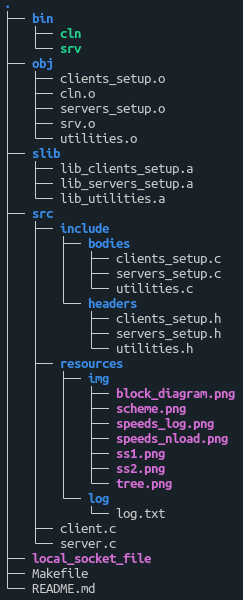
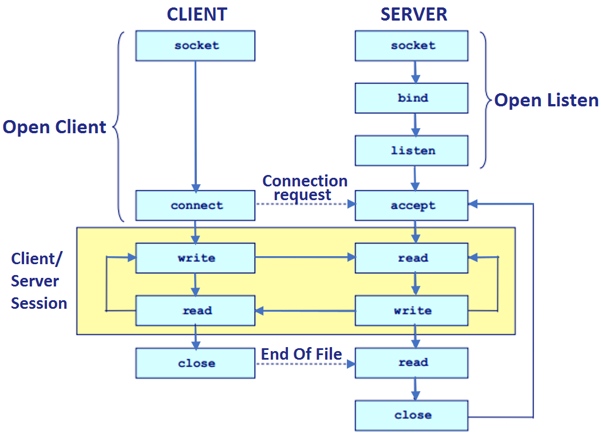
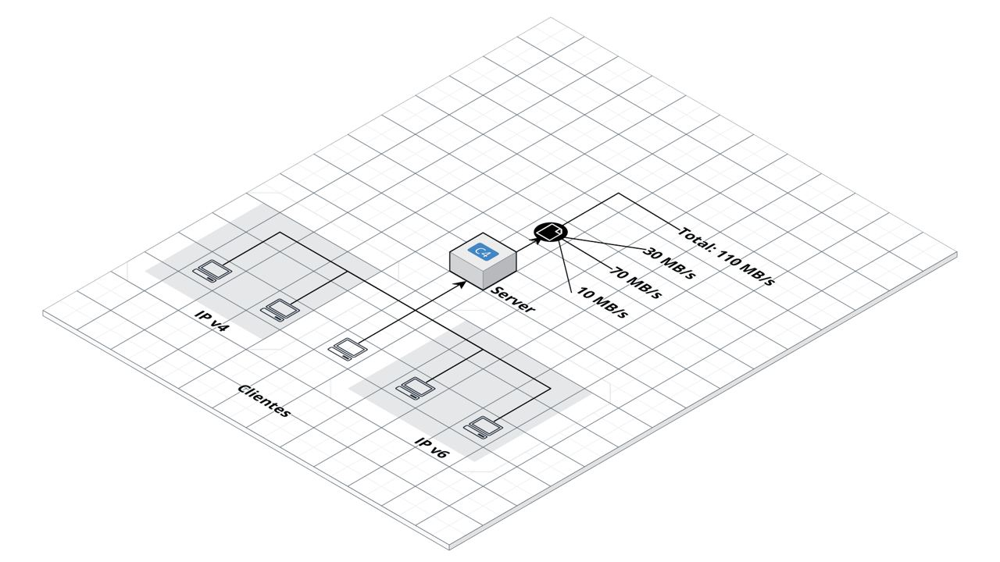
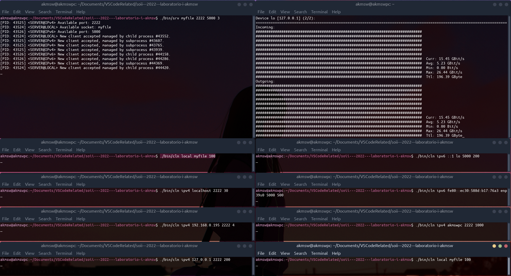
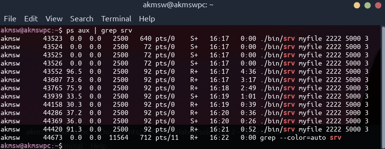
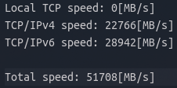

# Interprocess communication (1)
## Introduction
El presente es un trabajo práctico de laboratorio cuyo objetivo es el de desarrollar una arquitectura cliente-servidor capaz de soportar al menos tres protocolos distintos de la familia descripta en el header `<sys/socket.h>`.\
El servidor es capaz de soportar una o más instancias de clientes de los tres protocolos de manera simultánea, siendo cada instancia de servidor y cliente totalmente parametrizable.\
Adicionalmente, se toman métricas de variables de interés y se mantiene un registro de las mismas en un archivo de log que, al finalizar la ejecución del servidor, puede ser consultado.

## Startup
Para comenzar, se debe clonar el repositorio. Una vez hecho, podemos compilar todo el proyecto aprovechando el archivo makefile, con el comando:

`make all`

o, simplemente:

`make`

Esto compilará todo con las flags indicadas en la consigna:

`-Wall -pedantic -Werror -Wextra -Wconversion -std=gnu11`

Se organizó el proyecto en distintas carpetas para un mejor manejo de archivos. El código fuente en lenguaje C que engloba la resolución del trabajo se encuentra en la carpeta `src`. Los headers y cuerpos de las librerías utilizadas se encuentran en `src/include/headers` y `src/include/bodies` respectivamente.

Se crean carpetas adicionales para los archivos `.o`, `.a` y para los binarios ejecutables finales.

A continuación se proporciona una vista general de la organización de los archivos del proyecto:

>Para obtener información sobre cómo correr el programa, puede seguir leyendo este documento o ejecutar el cliente (o el servidor) con los parámetros `--help`, `-h` o `?` para desplegar el menú de ayuda.

## Development
Se comenzó estudiando el flujo de configuración y comunicación de clientes y servidores mediante sockets en C. El esquema adoptado es como el que se muestra en la siguiente figura:

\
*Figura 1: Esquema de configuración y comunicación cliente-servidor*

Lo que se busca con este primer trabajo práctico de laboratorio es lograr un sistema de comunicaciones como el que se muestra a continuación:

\
*Figura 2: Diagrama de componentes del sistema*

Se almacenará en un archivo de log, propiamente separadas, las sumas totales de las velocidades de los datos recibidos en cada una de las conexiones activas de cada tipo de protocolo soportado por el servidor. El tiempo (en segundos) entre escrituras en el archivo de log puede ser configurado por el usuario.

### Server
Se decidió trabajar con los siguientes protocolos de comunicación para el servidor:
- TCP/IP local
- TCP/IPv4
- TCP/IPv6

Para levantar el servidor y esperar conexiones, el usuario debe ingresar los siguientes parámetros, en el orden en el que se los lista a continuación:
1. Nombre del archivo de socket utilizado para la comunicación TCP/IP local.
1. Puerto receptor de comunicaciones TCP/IPv4.
1. Puerto receptor de comunicaciones TCP/IPv6.
1. Intervalo de tiempo, en segundos, entre escrituras al log (opcional).

Una vez levantado el servidor, se podrán recibir conexiones de clientes de cualquiera de los protocolos de conexión listados.

Para lograr simultaneidad de conexiones y evitar tener un servidor secuencial, se optó por la creación de procesos hijos (hilos) en el servidor.\
Esencialmente, se comienza con un hilo dedicado a validar los argumentos ingresados. Luego, este hilo crea tres procesos hijos y les asigna sus respectivos parámetros para levantar las conexiones. Mientras sus procesos hijos se encargan de atender clientes, el hilo padre crea el archivo de log y escribe en él las estadísticas recolectadas en intervalos de tiempo especificados por parámetro. Si el usuario no ingresa como cuarto parámetro un valor de tiempo de log, o ingresa un número menor o igual a cero, o ingresa un valor no numérico, se escribirá el archivo de log cada un segundo por defecto.

Cada vez que un proceso hijo reciba una conexión, el mismo creará un proceso hijo cuyo propósito único será el de escuchar cualquier mensaje proveniente del socket utilizado para la conexión establecida, y el ahora proceso padre volverá a quedar a la espera de nuevas conexiones, creando un nuevo proceso hijo por cada nueva conexión que llegue.

###  Client
El cliente, por su parte, simplemente establece una conexión mediante los parámetros recibidos y envía constantemente un buffer de tamaño especificado, y sólo se detendrá si se recibe una señal del tipo `SIGINT` (^C).\
A continuación se listan los parámetros necesarios para levantar un cliente de cada tipo:
- TCP/IP local:
  1. Protocolo utilizado ("local").
  1. Nombre del archivo de socket utilizado para la comunicación.
  2. Tamaño del buffer a enviar.
- TCP/IPv4:
  1. Protocolo utilizado ("ipv4").
  1. Address del servidor, en formato IPv4.
  1. Puerto del servidor al cual se le enviará la información.
  1. Tamaño del buffer a enviar.
- TCP/IPv6:
  1. Protocolo utilizado ("ipv6").
  1. Address del servidor, en formato IPv6.
  1. Interfaz de comunicación para conexión IPv6 (consultar comando `ifconfig`).
  1. Puerto del servidor al cual se le enviará la información.
  1. Tamaño del buffer a enviar.

Cuando la conexión cliente-servidor resulte exitosa, se le notificará al usuario, mediante un mensaje en la consola del servidor, que se estableció conexión con un nuevo cliente y se le proporcionará el ID del proceso asignado al mismo.\
Si el usuario desea terminar la comunicación entre un cliente y el servidor, puede hacerlo enviando la signal `SIGINT` (^C) al cliente en cuestión. El cliente, antes de terminar su conexión, notificará al servidor que dejará de transmitir mediante un mensaje especial de fin de transmisión (End-Of-Transmission message) para cerrar el socket correspondiente en ambos extremos.

## Running
>Para obtener ejemplos sobre cómo correr el programa, puede seguir leyendo este documento o ejecutar el cliente (o el servidor) con los parámetros `--examples`, `-e` o `!` para desplegar el menú de ejemplos.

A continuación se listan algunos ejemplos de ejecución, asumiendo que el proyecto fue compilado exitosamente y que el usuario se encuentra en la carpeta raíz del proyecto:
- Server:
  - `./bin/srv my_socket 2222 5000 1`
- Client:
  - `./bin/cln local my_socket 100`
  - `./bin/cln ipv4 localhost 2222 1000`
  - `./bin/cln ipv4 [$HOSTNAME] 2222 787`
  - `./bin/cln ipv4 127.0.0.1 2222 3500`
  - `./bin/cln ipv4 [IPv4 address] 2222 3`
  - `./bin/cln ipv6 ::1 lo 5000 500`
  - `./bin/cln ipv6 [IPv6 address] enp39s0 5000 27`

## Testing
Para poner a prueba el proyecto, se utilizó la herramienta `netcat` para simular clientes y servidores y sus interconexiones. Para poder observar el tráfico en las distintas conexiones de red y corroborar el correcto cálculo de las velocidades de transferencia de cada protocolo, se utilizó la herramienta `nload`.

## Screenshots
\
*Figura 3: Un servidor levantado atendiendo ocho instancias de clientes de diferentes protocolos.*

\
*Figura 4: Output del comando `ps aux | grep srv` para chequear la existencia de los procesos hijos que atienden los clientes.*

\
*Figura 5: Log de velocidades de transferencias en protocolos de red.*

\
*Figura 6: Output de comando `nload` para comparar con 'Total speed' (log).*

## Known issues
- Debido a que un tipo de conexión elegida es de tipo TCP/IP local, la herramienta de monitoreo de tráfico en sockets de red (`nload`) no muestra información al respecto, al no ser una conexión de red.
- El error entre las velocidades de recepción esperadas y las reales disminuye mientras mayor sea el tamaño del buffer a transmitir desde un cliente, debido a que no hay control de concurrencia en la escritura del log.
- El error mencionado en el item anterior está relacionado con la falta de control de concurrencia en los procesos hijos de los servidores a la hora de actualizar el valor del acumulador recibido por parámetro, perteneciente a la estructura de memoria compartida que contiene las estadísticas de velocidades de comunicación.
